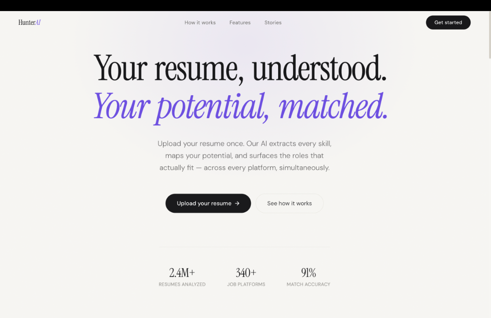
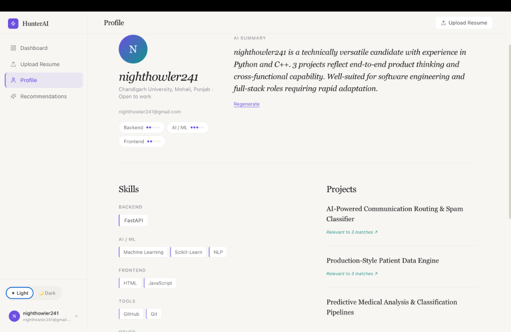
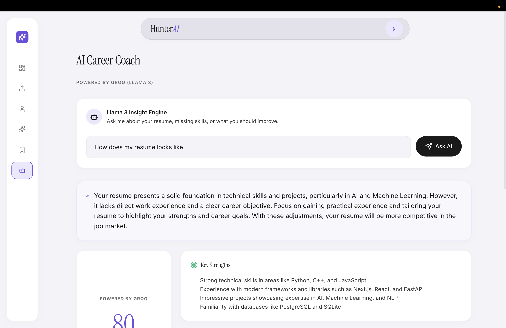
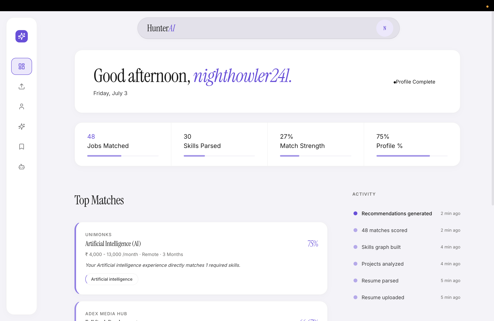

<div align="center">

# HunterAI 🎯

**An intelligent, multi-user web application for automated resume parsing and job matching.**

[](https://hunterai.me)
[](https://www.python.org/)
[](https://nextjs.org/)
[](https://opensource.org/licenses/MIT)

</div>

Trusted by students and early-career professionals shaping their futures, HunterAI is a seamless orchestration of LLM-based parsing and strict semantic matching to find the perfect internship or job opportunities.

```bash
git clone https://github.com/shaurya001/HunterAI.git
```

> [!TIP]
> If you're looking to quickly test the application live without setting it up locally, visit the production deployment at **[hunterai.me](https://hunterai.me)**!

For the core parsing logic, check out the `backend/` engine directory and the `frontend/` application.

## Why use HunterAI?

HunterAI provides a low-level supporting infrastructure for *any* intelligent candidate evaluation workflow:

*   **Intelligent Extraction & Dealbreaker Analysis** — Automatically parse user resumes using Gemini & Llama 3 to accurately extract profile details, skills, and projects without manual data entry. Additionally, a one-time ingestion pipeline extracts hard constraints (education, remote/on-site, graduation dates) from jobs to instantly filter out structural mismatches.
*   **Strict Semantic Matching** — Seamlessly cross-reference extracted skills with live job postings using a unidirectional satisfaction matrix to prevent basic skills from inflating match scores.
*   **Actionable Insights** — Review exact match percentages, identify missing skill gaps, and access direct application links instantly.

---

## 🌟 Key Features & Interface

### Interactive Landing Page
A modern, premium landing page designed to welcome users, showcase key statistics (resumes analyzed, supported job platforms, match accuracy), and provide a quick starting point.




### AI-Powered Resume Parsing & Profile Management
Simply upload a PDF resume, and HunterAI uses Large Language Models to generate a professional AI summary tailored to the candidate's profile.



### Interactive AI Career Coach
Engage in a two-way conversation with a personalized AI Career Coach (powered by Groq and LLaMA 3) to discuss your resume, identify skill gaps, and explore strategies to improve your candidacy.



### Smart Job Matching & Dynamic Filtering
The recommendation engine displays Match Percentages, Matched vs Missing Skills, and Direct Apply Links to platforms like LinkedIn and Wellfound. Users can also dynamically filter their recommendations by minimum stipend, location, remote-only requirements, and minimum match score thresholds.



---

## 🚀 Getting Started

### Local Development Setup

1. **Configure Environment Variables**
   Copy `.env.example` to your `.env` files in both the frontend and backend directories and populate your API credentials (Supabase, Gemini, Groq).

2. **Start the Backend Service (Python 3.11+)**
   ```bash
   cd backend
   uv run python main.py
   ```
   *The API will boot up on `http://127.0.0.1:8000`*

3. **Start the Frontend Application (Node v18+)**
   ```bash
   cd frontend
   npm install
   npm run dev
   ```
   *The client will run locally on `http://localhost:3000`*

---

## 🛠️ Tech Stack

*   **Frontend**: Next.js, React, Tailwind CSS
*   **Backend**: FastAPI (Python 3.11), SQLAlchemy, Uvicorn, UV package manager
*   **AI Engine**: Google Gemini API, Groq (Llama 3)
*   **Database & Auth**: Supabase (PostgreSQL, Supabase Authentication, Supabase Storage)

---

## 🌐 Deployment

Production configurations and `Dockerfile`s are provided for both the frontend and backend. 
*   **Frontend**: Easily deployable to platforms like Vercel or Netlify.
*   **Backend**: Deployable to services like Railway, Render, or any standard container hosting provider.
