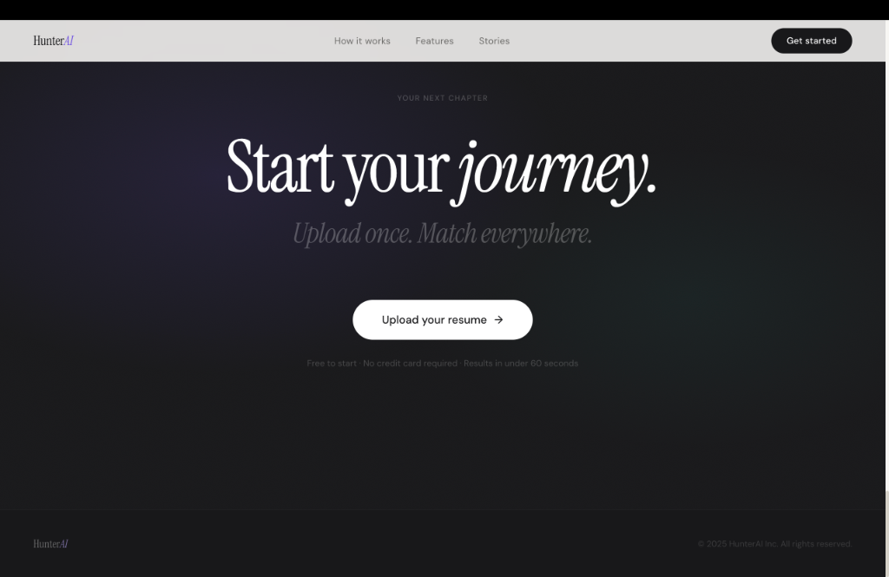

# HunterAI 🎯

HunterAI is a state-of-the-art career optimization platform that uses Google Gemini and Llama 3 (via Groq) to convert raw PDF resumes into rich, structured skill profiles. 
By cross-referencing candidate profiles with live job markets, it dynamically matches applicants with top-tier, relevant internship and job opportunities. 
The platform performs real-time skill gap analysis, detailing exactly which skills match and which ones need development to maximize landing success. 
Integrated with Supabase Auth and Storage, it delivers a secure, lightning-fast, and personalized ecosystem for modern job seekers.

---

## 🌟 Key Features & Interface

### 1. Interactive Landing Page
A modern, premium landing page designed to welcome users, showcase key statistics (resumes analyzed, supported job platforms, match accuracy), and provide a quick starting point.


*A clean, dark/light contrast footer motivates users to begin their journey in seconds.*


### 2. AI-Powered Resume Parsing & Profile Management
Simply upload a PDF resume, and HunterAI uses Large Language Models (Gemini & Llama 3 via Groq) to accurately extract profile details, skills, and projects. It generates a professional AI summary tailored to the candidate's profile.


### 3. Smart Job Matching & Recommendations
The recommendation engine automatically cross-references your parsed skills with live job postings to find your perfect fit. It displays:
*   **Match Percentage**: A visual progress ring indicating suitability.
*   **Matched vs. Missing Skills**: Clearly color-coded badges to help you identify gaps.
*   **Direct Apply Links**: Quick-access application links to platforms like LinkedIn, Wellfound, and more.


---

## 🛠️ Tech Stack

*   **Frontend**: Next.js, React, Tailwind CSS
*   **Backend**: FastAPI (Python 3.11), SQLAlchemy, Uvicorn, UV package manager
*   **AI Engine**: Google Gemini API, Groq (Llama 3)
*   **Database & Auth**: Supabase (PostgreSQL, Supabase Authentication, Supabase Storage)

---

## 🚀 Getting Started

### Prerequisites
*   Node.js (v18+)
*   Python (v3.11+)

### Local Development Setup

1. **Clone the Repository**
   ```bash
   git clone https://github.com/shaurya001/HunterAI.git
   cd HunterAI
   ```

2. **Configure Environment Variables**
   *   Copy `.env.example` to your `.env` files in both the frontend and backend directories and populate your API credentials (Supabase, Gemini, Groq).

3. **Start the Backend Service**
   ```bash
   cd backend
   uv run python main.py
   ```
   *The backend will boot up and be accessible on `http://127.0.0.1:8000`*

4. **Start the Frontend Application**
   ```bash
   cd frontend
   npm install
   npm run dev
   ```
   *The frontend application will run locally on `http://localhost:3000`*

---

## 📦 Project Structure

```text
├── backend/            # FastAPI Backend
│   ├── app/            # Application logic
│   └── main.py         # Entry point
├── frontend/           # Next.js Frontend
│   ├── src/            # Components, pages, and hooks
│   └── public/         # Static assets
├── assets/             # Project screenshots & media assets
└── pyproject.toml      # Backend dependencies configuration
```

---

## 🌐 Deployment

Production configurations and `Dockerfile`s are provided for both the frontend and backend. 
*   **Frontend**: Easily deployable to platforms like Vercel or Netlify.
*   **Backend**: Deployable to services like Railway, Render, or any standard container hosting provider.
